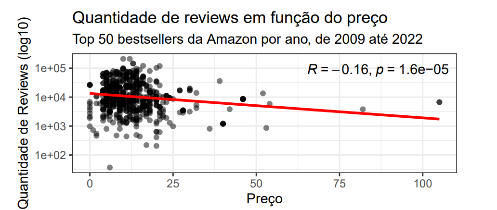
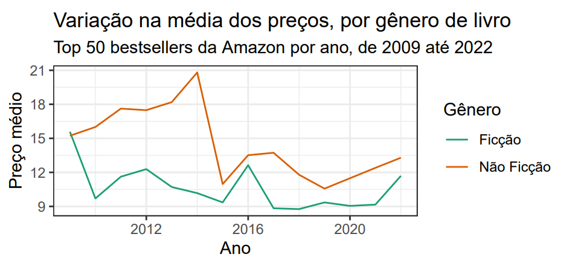
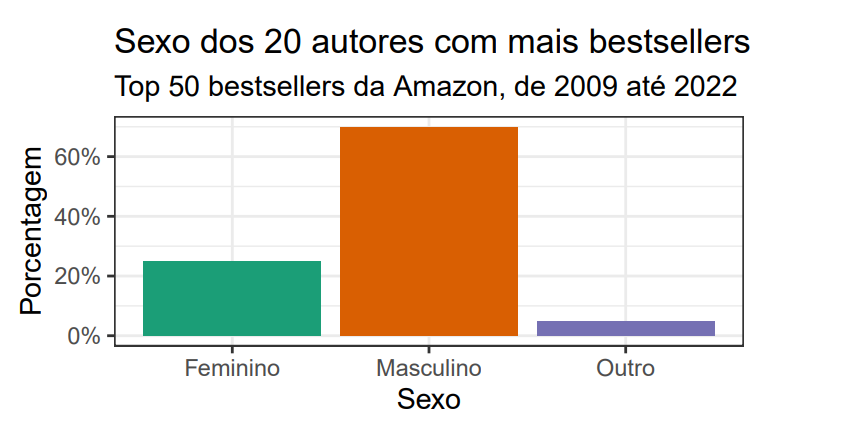
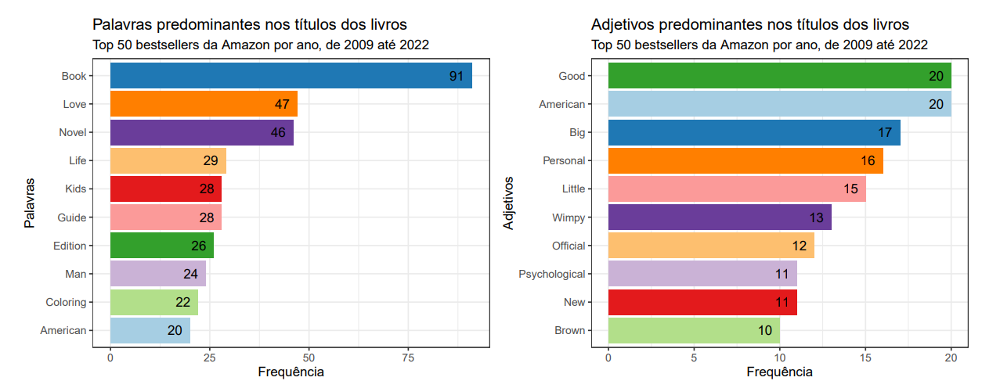
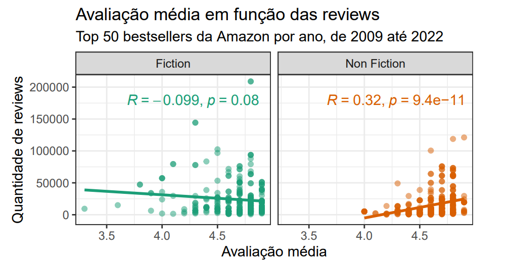
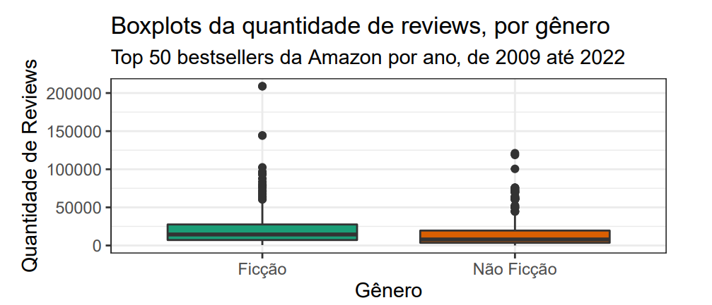
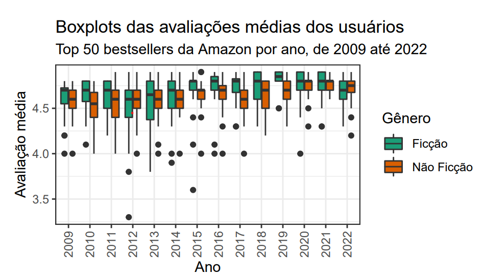
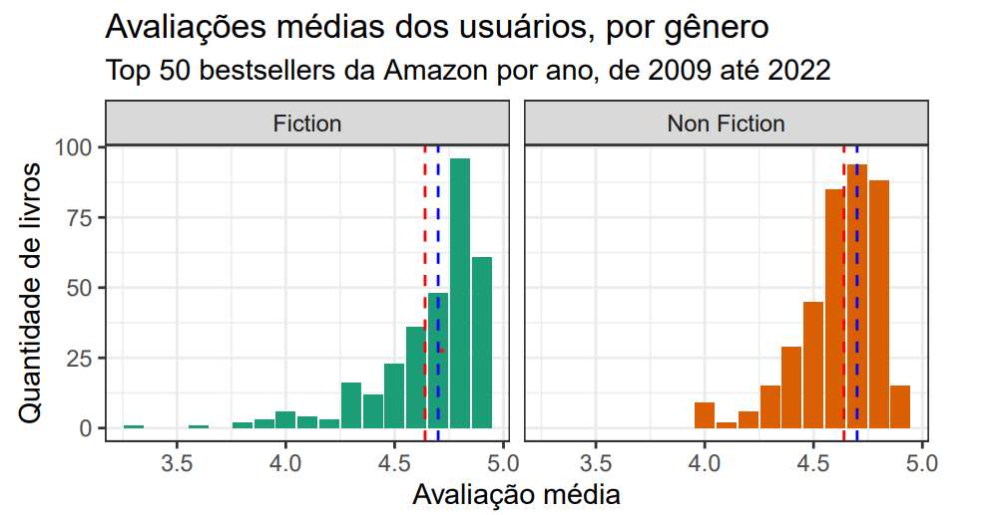

# Análise Estatística e Modelagem com Dados de Bestsellers da Amazon

## Descrição
Este projeto explora os dados de bestsellers da Amazon entre 2009 e 2022, com foco em variáveis como:
- **Preço dos livros**
- **Quantidade de reviews**
- **Gênero (ficção e não-ficção)**
- **Distribuição de palavras nos títulos**

### **Habilidades Demonstradas**
1. **Análise Descritiva:** Exploração detalhada das variáveis com gráficos e tabelas.
2. **Visualização de Dados:** Gráficos claros e informativos para transmitir insights.
3. **Modelagem Estatística:** Análise de correlação e regressão.

---

## Análise Descritiva e Resultados

### 1. **Quantidade de Reviews e Preço**
A relação entre preço e quantidade de reviews apresenta uma correlação negativa (\(R = -0.16\)), indicando que livros mais baratos tendem a ter mais reviews.

---

### 2. **Variação nos Preços Médios por Gênero**
Livros de não-ficção geralmente apresentam preços médios mais elevados em comparação a livros de ficção.

---

### 3. **Distribuição dos Autores por Gênero**
A análise dos 20 autores mais recorrentes nos bestsellers mostra predominância masculina.

---

### 4. **Palavras e Adjetivos Predominantes nos Títulos**
As palavras e adjetivos mais usados refletem tendências e estratégias de marketing dos autores.

---

### 5. **Avaliação Média vs. Quantidade de Reviews**
A relação entre avaliação média e quantidade de reviews varia conforme o gênero:
- Ficção: Correlação negativa e fraca (\(R = -0.099\)).
- Não-ficção: Correlação positiva moderada (\(R = 0.32\)).

---

### 6. **Distribuição de Reviews por Gênero**
Boxplots mostram que livros de não-ficção têm maior variação na quantidade de reviews.

---

### 7. **Avaliações Médias ao Longo dos Anos**
Boxplots indicam que a mediana das avaliações para ficção e não-ficção é estável, mas há maior variabilidade em não-ficção.

---

### 8. **Distribuição das Avaliações Médias**
A distribuição das avaliações é concentrada entre 4.0 e 5.0, com diferenças sutis entre ficção e não-ficção.

---

### 9. **Tabela Resumo: Top 20 Livros**
A tabela abaixo apresenta os 20 livros com maior número de reviews e suas avaliações máximas.

| Nome                                    | Autor           | Reviews  | Preço | Ano  | Gênero       |
|-----------------------------------------|-----------------|----------|-------|------|--------------|
| A Promised Land                         | Barack Obama    | 121109   | 16    | 2020 | Não-Ficção   |
| I Love You to the Moon and Back         | Amelia Hepworth | 51188    | 4     | 2020 | Ficção       |
| ...                                     | ...             | ...      | ...   | ...  | ...          |

_Tabela completa no repositório:_ [Tabela](analysis_tabela_me115.png)

---

## Conclusões
1. **Insights de Mercado:** Livros mais baratos têm mais reviews, enquanto livros de não-ficção têm preços médios mais altos.
2. **Gênero Dominante:** Autores masculinos dominam o mercado de bestsellers, refletindo possíveis tendências culturais.
3. **Preferências do Público:** Palavras e adjetivos nos títulos sugerem foco em temáticas familiares, emocionais e práticas.

---

##  Referências
- Dados extraídos de bestsellers da Amazon (2009–2022).
- Ferramentas: R, ggplot2 para visualizações, dplyr para manipulação de dados.
